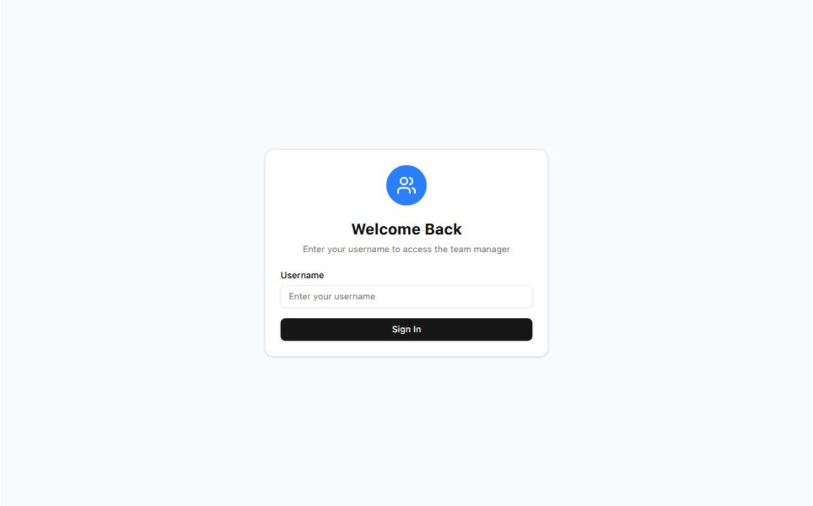

# Projects

## 🚀 My Projects

Explore some of the exciting projects I've worked on:

---

## 👥 [Team Management App](https://team-management-app-beta.vercel.app/)

[Click here to view the project](https://team-management-app-beta.vercel.app/)

### 📝 Description

**Team Management App** is a robust and user-friendly team management tool built with **Next.js**, **Tailwind CSS**, and **shadcn/ui**. It enables seamless CRUD operations, intuitive modal interfaces, and efficient global state handling using **Context API**—all within a clean, modern design.

### 🌟 Key Features

- ➕ **Create, update, and delete** team members with ease
- ♾️ **Infinite loading** for seamless pagination and performance
- 🧠 **Context API** for global state management
- 🪟 **Modal popups** with `shadcn/ui` for smooth UX
- 🎨 Responsive design powered by **Tailwind CSS**
- ⚡ Fast and scalable, built on **Next.js**

---

## 🎬 [MovieVerse](https://react-movies-iota-ruby.vercel.app/)

[Click me to view my project](https://react-movies-iota-ruby.vercel.app/)

### 📝 Description:

**MovieVerse** is a fast and responsive movie app built with **React**, **Vite**, and **Tailwind CSS**. Users can search movies with optimized debounce, explore trending titles, and view detailed movie info—all in a clean, modern UI.

### 🌟 Key Features:

- 🔍 Debounced movie search
- 🔥 Trending movies display
- 🎞️ Movie detail view
- 💅 Tailwind-powered responsive design

## 🎮 [GameHub](https://game-hub-peach-one.vercel.app/)

[Click me to view my project](https://game-hub-peach-one.vercel.app/)

### 📝 Description:

**GameHub** is an innovative gaming platform designed to help users discover, explore, and filter through a vast collection of games. Built with **Vite.js**, this website provides a smooth and fast user experience, allowing players to search for their favorite games and sort them by popularity, genre, or rating. Whether you're a casual gamer or a hardcore enthusiast, **GameHub** is your one-stop platform to find the next game to play.

### 🌟 Key Features:

- 🔍 **Game Search:** Easily search and find games by title, genre, or platform.
- ⭐ **Popular Games Filter:** Sort games by popularity, trending status, or top-rated titles to find what’s hot.
- 🎮 **Game Details:** View in-depth information about each game, including descriptions, trailers, ratings, and user reviews.

---

## 🛠️ [Issue Tracker](https://issue-tracker-qh2y.vercel.app/)

[Click me to view my project](https://issue-tracker-qh2y.vercel.app/)

### 📝 Description:

The **Issue Tracker** is a dynamic platform designed to streamline issue management in software development. Built with **Next.js** and integrated with **Google OAuth**, this application allows users to:

- **Create Issues**: Easily report bugs, tasks, or feature requests.
- **Delete Issues**: Remove irrelevant or resolved issues with a single click.
- **Filter Issues**: View issues by status, priority, assignee, and more.
- **Assign Issues**: Effortlessly assign issues to team members based on expertise or availability.

By leveraging **Next.js** for fast and scalable server-side rendering, and integrating **OAuth Google Sign-In** for secure user authentication, the project simplifies the development workflow, enhances team collaboration, and provides users with seamless interaction and management of their issues.

---

## 🧭 [Responsive Sushi Website](https://sushi-web-pi.vercel.app/)

[Click me to view my project](https://sushi-web-pi.vercel.app/)

### 📝 Description:

The Responsive Sushi Website is a sleek and lightweight front-end project built using Vite, HTML, CSS, and JavaScript. Designed for modern restaurants or food brands, this website delivers an engaging user experience with fast load times, smooth animations, and a fully responsive layout.

Vite enables an ultra-fast development environment with instant hot module replacement (HMR), making it easy to scale or customize this project.

🌟 Key Features:

🍱 Built with Vite
Leverages Vite for lightning-fast development, hot reloading, and optimized builds — ideal for modern web workflows.

📱 Responsive Layout
Designed to adapt flawlessly to all screen sizes using a mobile-first CSS strategy.

🍣 Animated Navbar & Smooth UI
Includes a responsive navbar with a sliding drawer menu and smooth CSS transitions for an enhanced user experience.

🧩 CSS Utility Classes
Custom utility classes simplify styling for layout, spacing, typography, and color — no external frameworks required.

🎨 Modern, Minimal Aesthetic
Clean design using semantic HTML5 and accessible styling principles for clarity and visual appeal.

⚡ Fast & Framework-Free
No bloated frameworks — just pure HTML, CSS, and JS backed by Vite for blazing performance.

---

## 🧭 [Responsive Landing Page](https://intro-section-drop-navbar.vercel.app/)

[Click me to view my project](https://intro-section-drop-navbar.vercel.app/)

### 📝 Description:

The Responsive Landing Page is a sleek, modern web page designed to showcase a product or service with elegance and performance. Built using HTML, CSS, and JavaScript, it features a fully responsive navbar and hero section that adapts beautifully to all screen sizes.

This project emphasizes clean design, user experience, and responsiveness — making it a perfect foundation for startups, personal portfolios, or landing pages.

🌟 Key Features:
📱 Fully Responsive Navbar: The navbar adapts to all screen sizes and includes a mobile drawer toggle with smooth animation.

🖼️ Hero Section: A visually appealing hero block with compelling messaging and an image layout optimized for both desktop and mobile.

🎨 Modern UI: Designed with accessibility and clarity in mind, using semantic HTML and minimal CSS.

⚙️ Lightweight & Fast: No frameworks, just pure HTML/CSS/JS — built for performance and simplicity.

---
